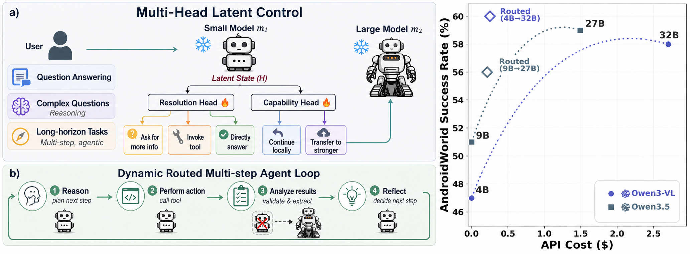

<div align="center">

# 🔥 Multi-Head Latent Control

### Up to 90% lower API cost through dynamic, capability-aware multi-model routing

[](#two-complementary-pipelines)
[](#repository-layout)
[](#reported-gains)

**Route each question by whether the model can actually solve it, not by a fixed task or question category.**

**Higher success · Smarter tool use · Better abstention · Large-model compute only when it matters**

</div>



<p align="center"><em>Latent control heads guide answering, tool use, clarification, continued reasoning, and selective routing to a stronger model.</em></p>


## 🎯 The Core Idea

Most model-routing systems make a static decision from the input: classify the question by topic, difficulty, or task type, then send it to a predetermined model. But two questions from the same category can require very different capabilities, and an agent's needs can change from one reasoning step to the next.

**Multi-Head Latent Control routes dynamically from the model's own hidden state.** The small model starts the task, and lightweight control heads estimate whether it can handle the current question or step. The system can then answer directly, continue reasoning, ask for clarification, invoke a tool, abstain safely, or transfer control to a stronger model.

| Conventional routing | Multi-Head Latent Control |
| --- | --- |
| Routes by task or question category | Routes by the model's estimated capability on the actual question |
| Makes one decision before inference | Can make a new decision at each step of an agent trajectory |
| Chooses only which model to call | Controls answering, abstention, clarification, tool use, continuation, and escalation |
| Often overuses expensive models | Keeps easy work local and spends more only when the latent signal indicates it is needed |

## ✨ Why This Matters

Large models are powerful, but using them for every request is expensive. Small models are efficient, but they do not always know when they are likely to fail. Multi-Head Latent Control trains lightweight auxiliary heads on frozen LLM hidden states, giving the system a learned signal for when to answer, abstain, ask, use a tool, continue, or escalate during inference.

| What the system enables | Practical benefit |
| --- | --- |
| 🧠 Read confidence and capability from latent states | Detect likely failures on the actual question rather than guessing from its category |
| 🔀 Route only when the current model needs help | Reduce plotted API cost by up to approximately 90% without sacrificing success |
| 🛠️ Ask, use tools, answer, continue, abstain, or transfer | Turn a language model into a more deliberate and reliable agent |
| 🛡️ Improve confidence-aware abstention | Avoid confidently returning an answer when the latent signal indicates likely failure |
| ❄️ Keep the base LLM frozen | Train small control modules instead of fine-tuning the full model |
| 🔌 Support multiple model families | Use the same workflow with Qwen3-VL, Qwen3.5, and Gemma 4 variants |

<a id="reported-gains"></a>
## 📈 Reported Gains

| AndroidWorld setting | Base success | Routed success | Gain | Takeaway |
| --- | ---: | ---: | ---: | --- |
| Qwen3-VL 4B → 32B | 47% | ≈60% | **≈+13 points** | Approximately 90% lower plotted API cost than 32B-only while exceeding its 58% success point |
| Qwen3.5 9B → 27B | 51% | 56% | **+5 points** | Selective routing recovers much of the stronger model's capability at a fraction of its plotted cost |

The cost reduction and success values above are approximate readings from the displayed AndroidWorld configurations. They should not be interpreted as universal gains across every model, routing threshold, workload, or benchmark.

<a id="two-complementary-pipelines"></a>
## 🧩 Two Complementary Pipelines

| Pipeline | Role | Stages |
| --- | --- | --- |
| **Global control head** | Learns a general latent signal from a mixed-source dataset for confidence-aware control and routing | Generate → label → train → benchmark |
| **Local When2Call head** | Learns a local 4-class control signal from `nvidia/When2Call` | Build labels → generate completions → train → evaluate |

## 🚀 Choose Your Path

| Goal | Start here |
| --- | --- |
| Train the global control head | [Global Head Quick Start](#global-head-quick-start) |
| Train and evaluate the local head | [When2Call Quick Start](#when2call-quick-start) |
| Evaluate dynamic model routing | [Multi-Agent Benchmark](#multi-agent-benchmark-example) |
| Run the embodied-agent evaluation | [Android World Benchmark](#android-world-benchmark) |
| Reproduce the released setup | [Environment](#environment) and [Reproducibility Notes](#reproducibility-notes) |

## 📦 What Is Included

- training and labeling scripts for the global head
- training and evaluation scripts for the local head
- training recipes under `recipes/training/` and `when2call/receipes/`
- multi-agent benchmarking scripts under `multi_agenT_bench/`
- inference utilities under `inference/`

### Not included in Git

- training datasets
- downloaded base models
- trained checkpoints
- benchmark outputs

The trained heads and training data will be hosted separately because of their size.

<a id="release-artifacts"></a>
## 📥 Release Artifacts

| Artifact | Link |
| --- | --- |
| Trained global and local control heads | **Coming soon** (`TRAINED_HEADS_URL`) |
| Processed training data | **Coming soon** (`TRAINING_DATA_URL`) |

Replace the placeholders above with the public artifact links when the files are released. After downloading, place the trained heads under `trained_models/` and the training data under `data/train/`, preserving the directory names used by the recipes.

For exact paper reproduction, use the released processed training data rather than regenerating it from the latest upstream dataset versions. The generation scripts are provided for transparency and for creating new data.

Expected runtime/output directories are:

```text
data/
  train/
  benchmarks/
trained_models/
eval_outputs/
```

All released configs use repo-relative paths such as `data/train/...` and `trained_models/...`.

<a id="repository-layout"></a>
## 🗂️ Repository Layout

- `combined_all_datagen_multimodel.py`: mixed-source raw generation for the global head
- `combined_all_labeling_multimodel.py`: correctness labeling for generated global-head data
- `train_head_standalone_unsloth_regression_weighted_multimodel.py`: global-head training
- `recipes/training/`: global-head recipes
- `when2call/`: local-head data processing, training, and evaluation
- `when2call/receipes/`: local-head recipes
- `multi_agenT_bench/`: multi-agent evaluation scripts
- `inference/`: inference-time helper utilities

Note: the folder name `receipes` is kept unchanged to avoid breaking script paths.

<a id="environment"></a>
## ⚙️ Environment

Use Python 3.10 or 3.11 in a CUDA-enabled environment compatible with your GPU drivers and base models.

Install a CUDA-matched `torch` build first, then install the remaining dependencies:

```bash
pip install -r requirements.txt
```

Optional packages used by some math-verification paths:

```bash
pip install latex2sympy2-extended math-verify
```

Run all commands below from the repository root.

The exact PyTorch, CUDA, vLLM, Transformers, Unsloth, and Flash Attention versions must be mutually compatible. Record the versions used for a run with `pip freeze > environment-freeze.txt`; the final artifact release should include the freeze from the paper environment. Training recipes enable Weights & Biases by default, so run `wandb login`, set `WANDB_MODE=offline`, or set `wandb_enabled: false` in the selected recipe.

<a id="global-head-quick-start"></a>
## 🌐 Global Head Quick Start

### 1) Generate raw completions

```bash
python combined_all_datagen_multimodel.py \
  --model-id Qwen/Qwen3.5-2B \
  --model-family qwen3_5 \
  --thinking-mode on \
  --run-name Qwen3_5_2B_think_on_hard_Mixed_Sources_120k \
  --save-root data/train/Qwen3.5/Qwen3_5_2B_think_on_hard_Mixed_Sources_120k
```

### 2) Label the generated data

```bash
python combined_all_labeling_multimodel.py \
  --run-root data/train/Qwen3.5/Qwen3_5_2B_think_on_hard_Mixed_Sources_120k \
  --judge-model-id Qwen/Qwen3-VL-30B-A3B-Instruct-FP8
```

### 3) Train the head

```bash
python train_head_standalone_unsloth_regression_weighted_multimodel.py \
  --config recipes/training/qwen3_5_2b_think_on.yaml
```

To switch models or thinking modes, swap the run name and recipe file. The released recipes cover Qwen3.5, Qwen3-VL, and Gemma 4 variants.

<a id="when2call-quick-start"></a>
## 📞 When2Call Quick Start

### 1) Build labeled training data

```bash
python when2call/when2call_build_head_labels_4class.py \
  --dataset_id nvidia/When2Call \
  --splits train_sft train_pref \
  --output_dir data/train/when2call/when2call_processed_4class \
  --model_id Qwen/Qwen3-30B-A3B-Instruct-2507-FP8 \
  --tokenizer_id Qwen/Qwen3-30B-A3B-Instruct-2507-FP8 \
  --dtype auto \
  --batch_size 256 \
  --max_tokens 16000 \
  --gpu_memory_utilization 0.50 \
  --tensor_parallel_size 1 \
  --max_model_len 32000 \
  --seed 42 \
  --resume \
  --export_parquet
```

### 2) Generate training completions

```bash
python when2call/when2call_generate_completions_4class.py \
  --input_path data/train/when2call/when2call_processed_4class/when2call_aux_labels.jsonl \
  --output_dir data/train/when2call/qwen3vl/Qwen3-VL-2B-Instruct_4class \
  --model_id Qwen/Qwen3-VL-2B-Instruct \
  --model_family qwen3_vl \
  --thinking_mode off \
  --batch_size 64 \
  --max_tokens 16000 \
  --gpu_memory_utilization 0.90 \
  --resume
```

### 3) Train the local head

```bash
python when2call/train_when2call_head_4class_3sigmoid.py \
  --config when2call/receipes/train_head_Qwen3-VL-2B-Instruct_4class.yaml
```

### 4) Generate evaluation completions

```bash
python when2call/eval/generate_when2call_eval_completions_4class.py \
  --model_id Qwen/Qwen3-VL-2B-Instruct \
  --output_path eval_outputs/when2call/Qwen3-VL-2B-Instruct/when2call_test_generated_4class.parquet
```

### 5) Evaluate the trained head

```bash
python when2call/eval/eval_when2call_head_only_4class_3sigmoid.py \
  --model_name_or_path Qwen/Qwen3-VL-2B-Instruct \
  --head_checkpoint_path trained_models/Qwen3-VL-2B-Instruct_When2call_4class/head-final.pt \
  --generated_eval_path eval_outputs/when2call/Qwen3-VL-2B-Instruct/when2call_test_generated_4class.parquet \
  --output_dir eval_outputs/when2call/Qwen3-VL-2B-Instruct/head_only_eval_4class
```

```bash
python when2call/eval/eval_when2call_model_only_judge_4class.py \
  --generated_eval_path eval_outputs/when2call/Qwen3-VL-2B-Instruct/when2call_test_generated_4class.parquet \
  --output_dir eval_outputs/when2call/Qwen3-VL-2B-Instruct/model_only_judge_eval_4class
```

Swap the model id, output directory, and recipe file for the other When2Call variants in `when2call/receipes/`.

<a id="multi-agent-benchmark-example"></a>
## 🤝 Multi-Agent Benchmark Example

```bash
python multi_agenT_bench/run_multi_agent_generate_then_eval.py \
  --benchmark triviaqa \
  --model1_name_or_path Qwen/Qwen3-VL-2B-Thinking \
  --model2_name_or_path Qwen/Qwen3-VL-32B-Thinking-FP8 \
  --model1_aux_head_ckpt trained_models/Qwen3VL-2B_Thinking_120K_lite/aux_head_final.pt \
  --model1_model_family qwen3_vl \
  --model1_thinking_mode on \
  --model2_model_family qwen3_vl \
  --model2_thinking_mode on \
  --strategy_names single_agent_model1,single_agent_model2,m1_after_finish_handoff_fresh_m2 \
  --model1_aux_thresholds 0.5,0.6,0.7,0.8,0.9 \
  --model2_aux_threshold 0.80 \
  --output_base_root eval_outputs/multi_agent_compact
```

Most benchmark datasets are downloaded from Hugging Face automatically. The two local CSV modes require:

- `math`: `data/benchmarks/merged_math.csv`
- `mmlu_pro`: `data/benchmarks/test.csv`

These CSV files are not part of this repository. Until their source or preparation script is released, use one of the Hugging Face-backed modes such as `triviaqa`, `mathvista`, or `simplevqa`.

<a id="android-world-benchmark"></a>
## 📱 Android World Benchmark

For Android World benchmarking, use the upstream MobileAgent Android World implementation here:

[X-PLUG/MobileAgent: `Mobile-Agent-v3.5/android_world_v3.5`](https://github.com/X-PLUG/MobileAgent/tree/main/Mobile-Agent-v3.5/android_world_v3.5)

Follow their setup and run instructions step by step. Use the Mobile-Agent revision recorded with your experiment because the upstream repository may change after this release.

The intended service layout is:

- small-model vLLM OpenAI server: port `8000`
- auxiliary-head verifier proxy: port `8001`
- large-model vLLM OpenAI server: port `8002`

After starting the small and large vLLM servers according to the Mobile-Agent instructions, launch the verifier proxy from this repository root. For Qwen3-VL, run:

```bash
GENERATOR_BASE_URL=http://127.0.0.1:8000/v1 \
GENERATOR_MODEL_NAME=Qwen/Qwen3-VL-4B-Instruct \
AUX_MODEL_NAME_OR_PATH=Qwen/Qwen3-VL-4B-Instruct \
AUX_HEAD_CKPT=trained_models/Qwen3VL-4B_instruct_120K/aux_head_final.pt \
PORT=8001 \
python inference/qwen3vl/android_world/vllm_verfier_server.py
```

For Qwen3.5, use `vllm_verfier_server_qwen3_5.py` and set the corresponding `GENERATOR_MODEL_NAME`, `AUX_MODEL_NAME_OR_PATH`, `AUX_MODEL_FAMILY`, `AUX_THINKING_MODE`, and `AUX_HEAD_CKPT` values. Configure Mobile-Agent's small-model endpoint as `http://127.0.0.1:8001/v1` and its large-model endpoint as `http://127.0.0.1:8002/v1`.

This repository provides the verifier proxy only. Android SDK, emulator or device, Android World, and Mobile-Agent installation remain governed by the linked upstream instructions.

<a id="reproducibility-notes"></a>
